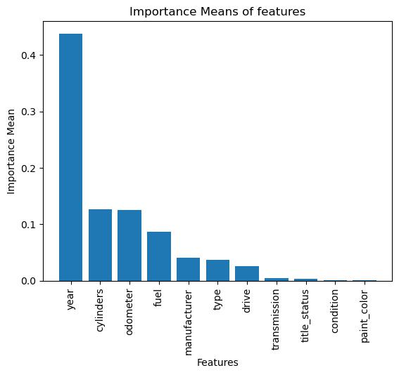

# Used-Cars-Analysis
This project is my second practical application from UC Berkeley's MLAI bootcamp. The task is to analyze a used car dataset to find what features consumers value in used cars. Then, I need to report my findings to a general audience. Though the dataset was originally 3 million, we were given only a small portion of the data to ensure the speed of processing the data. The full work and report can be found on this [notebook](https://github.com/DKW2/Used-Cars-Analysis/blob/main/Used%20Car%20Analysis.ipynb).

# Report
Starting with a dataset of used car prices containing 426880 rows, most of the data are missing values while others had outliers that needed to be filtered out. In addition, features such as "id", "VIN", and "model" were removed from the dataset to maximize the amount of remaining data and remove unnecessary features. As a result, the main dataset was reduced to around 102029 rows, which is around 25% of the original dataset. Though reduced by such an amount, it still is a lot of data to conduct analysis on.

Utilizing multiple regression models such as Linear Regression and Ridge, I tried training the best model to predict used car sales prices. The models all shared similar error scores, with most having a mean error of around $7200 and the worst at $8700:

From these models, I analyzed which features were the most impactful in determining sales price:

As we can see, **year, cylinders, odometer, and fuel** all have impact with year being the standout feature. Besides these 4, we note that **manufacturer, type, and drive** also have impact, but not as much. Any other feature such as **paint_color** or **condition** had very little impact.

Now that we know which features are impactful, I looked for how they exactly affect sales price by analyzing the coefficients in the linear regression model. Here are the results that I found (also ordered by importance):
* Used cars that were manufactured during recent years (2017-Present) will have a higher price than those that were released earlier. However, some antique cars that were manufactured way back in the past (1920's - 1950's) do have higher prices.
* The more cylinders a used car has, the higher the sales price. This is probably due to the car having higher performance.
* The price of used cars decreases as the odometer of the car increases. This is likely due to the customer having the perception of the car being too used.
* Used cars that utilize diesel fuel cost more than those that use regular gasoline, in all likelihood due to the view that diesel powered vehicles are more efficient than gasoline powered vehicles
* Used cars from expensive car brands such as Tesla or Ferrari will have higher prices because of their reputation. Cars with normal manufacturers such as Nissan will have a lower price.
* Used cars that are convertibles, trucks/utility vehicles, or luxury cars have higher prices compared to regular automobiles.
* Paint color, title_status, transmission, and condition does not have much impact on sales price

### Summary
To summarize, there are many factors that consumers use to increase/decrease a used car's value. These boil down to the used car's current reputational value, minimum usage, and performance. Factors such as paint color or condition have little to no impact on the price since these can be fixed easily. However, features such as the car's manufacturer or engine type are much more important because they define the used car and are immutable (most of the time). This is demonstrated by the fact that the car's manufactured year is usually the strongest indicator for its price.

### Next Steps/Recommendations
When managing their inventory for a car dealership, car dealers should pay attention to these factors to ensure a good variety in their business, so there's a supply for whatever consumers demand. They can also use these observations to decide on what used cars to purchase for the best return of investment. In addition, these factors can help car dealers structure their advertisements/pitches, focusing on car features that are valuable to the consumers. Lastly, when doing business, it would help if car dealers can confirm or deny the correlation between these features and used car prices. If not, then we would probably need a larger dataset to conduct analysis on.

### Reflection
If I were to conduct this analysis again, I would have liked to have the whole 4 million dataset since I had to drop so many rows from the given dataset. In addition, I would probably try to use random forests since they seem more fitting to use for categorical variables. However, since we haven't gone through forests, I'm unsure if it's applicable to this problem. Besides that, I wish the dataset didn't have so many missing values. Though it would be interesting to try training with the whole dataset by imputing the missing values. However, with so many imputed values, the trained model might be completely off from the actual data.
